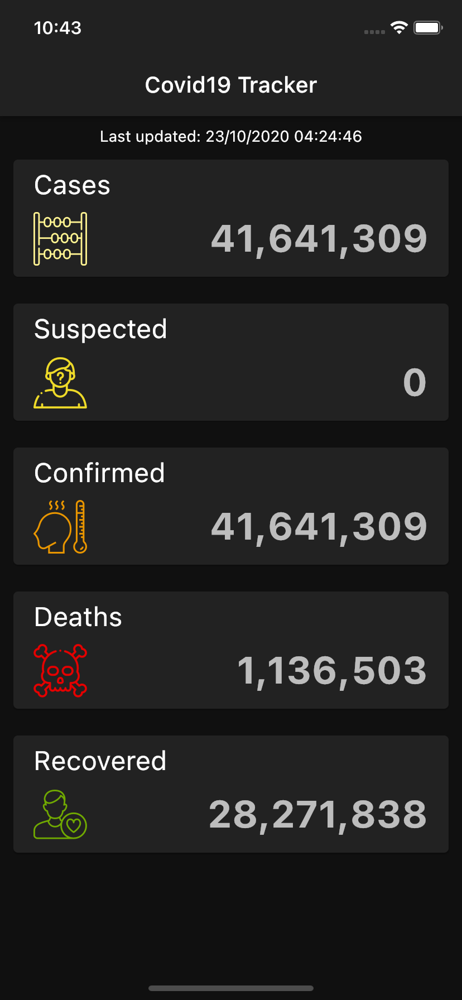

# covid19

A Covid19 World Record Tracker

## Description

<hr>
Covid19 is Cross-Platform tracker, all data are from: https://ncov2019-admin.firebaseapp.com



## Getting Started

<hr>
To test the app make sure to sign up, create a file called `api_keys.dart` in `lib/app/services` and add the following:

```dart
class ApiKeys {
  static String ncovSandBoxKey = "your auth code here"; // IMPORTANT! WITHOUT THIS IT WON'T WORK
}

```

 If you want to test the requests using `api/ncov_2019_api.http` and the REST Client extension add the authorization code to `.vscode/settings.json` like this:

```json
{
    "rest-client.environmentVariables": {
        "sandbox": {
            "baseUrl": "https://ncov2019-admin.firebaseapp.com",
            "authorization":"your authorization token here",
            "accessToken": "your access token here"

        },
        "production": {}
    }
}

```

After that, go to `api/ncov_2019_api.http` and send the first request, this will return an access token that you need to add to settings.json just like the authorization one.

**Note**: this is only needed when testing the requests in `api/ncov_2019_api.http` The app will refresh access token by itself.
